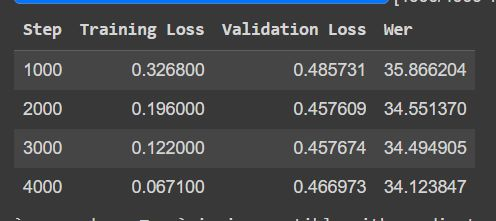
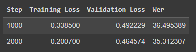

# whisper_id2223

This is the repository for lab 2 of class ID2223.

In this ReadME, the general development of the project will be described. 

1. We first tried to follow the feature extraction, and we chose Spanish as a language. The common voice dataset for Spanish is almost 50 GB, so it was quite impossible to upload it to the GoogleCollab RAM in the assigned VM. So we decided to go for another language. This was done in __spanish_whisper_features.ipynb__. 
2. Second we went with Italian, which was a much smaller language than Spanish, but still quite big. The size of the dataset from common voice in italian was close to 1.5 GB. Enough to put in Memory. But the Mapping function for some reason was taking forever. It parallelizes in 4 machines, and each machine was gonna take 5-6 hours. And machines failed eventually, so you had to restart again. So we decided to go for another language. This was done in __italian_whisper_features.ipynb__. 
3. We decided to go for swedish, cause it was known to work. In the notebook __feature_pipeline.ipynb__ we extract features, apply the mapping function, and then upload them to the hub. 
4. Then we trained in the training pipeline which is __training_pipeline.ipynb__, and when finishing training, we upload our final weights to the huggingspace hub. These are our results. We trained for 4000 steps. 

5. The model is served in __app.py__, and can be seen [here](https://huggingface.co/spaces/jsra2/swedish_transcribe_whisper). The modification we made to the app, was that you can still record from your microphone, and put in text what you say, but we also extended it so that the transcribe text goes into another open-source swedish model, that continues the sequence. It is an open-source text-to-text model. So first audio goes to text, and then that text is sent to another model, to continue the sequence. 

After we have a working model, we decided to think of some ways to improve the model.

The first one, we thought that making a smoothing to the log-mel graphs would improve the generalization capability of the model. We applied an image smoothing from openCV library. The feature pipeline __swedish_whisper_features_mod.ipynb__ contains a feature pipeline in which each log-mel image is applied a smoothing transformation. The *augmented* dataset is then uploaded to huggingface. We then trained the model again, but at this point we think Google Collab was quite tired of us, cause it kept crashing, and we were never able to complete training. 

At a certain point after 2000 steps, we saw that there was still good WER evaluation metric, but it was not gonna get better than the original model, so we dropped this idea. 

Last thing we tried was to do hyperparameter tuning with both external HP search tools, *sigopt* and *optuna*, but as we said, Google Collab was not collaborating anymore (pun intended). Hyperparameter search is seen in the notebook __swedish_whisper_train_hyper.ipynb__. 

